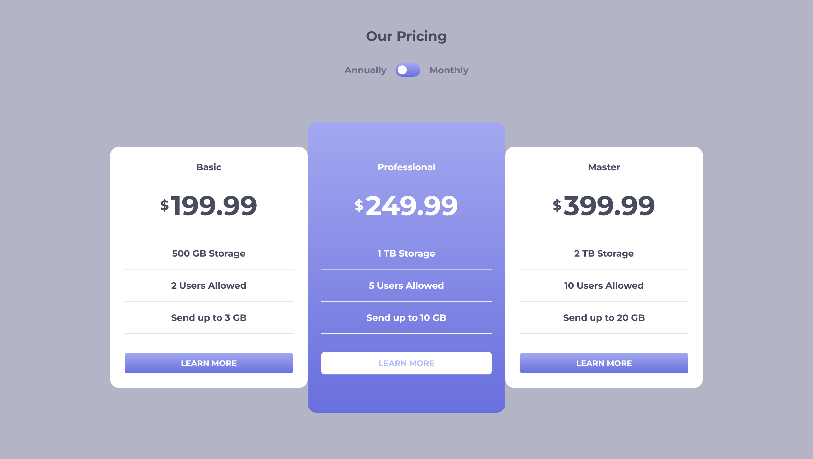
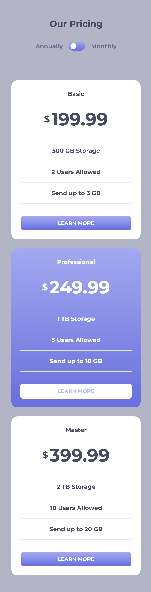

# Frontend Mentor - Pricing component with toggle solution

This is a solution to the [Pricing component with toggle challenge on Frontend Mentor](https://www.frontendmentor.io/challenges/pricing-component-with-toggle-8vPwRMIC). Frontend Mentor challenges help you improve your coding skills by building realistic projects. 

## Table of contents

- [Overview](#overview)
  - [The challenge](#the-challenge)
  - [Screenshot](#screenshot)
  - [Links](#links)
- [My process](#my-process)
  - [Built with](#built-with)
  - [What I learned](#what-i-learned)
  - [Continued development](#continued-development)
  - [Useful resources](#useful-resources)
- [Author](#author)

## Overview

### The challenge

Users should be able to:

- View the optimal layout for the component depending on their device's screen size
- Control the toggle with both their mouse/trackpad and their keyboard

### Screenshot

### Links

- Solution URL: [GitHub](https://github.com/humbl3LilaS/pricing-component-with-toggle.git)
- Live Site URL: [Vercel](https://pricing-component-with-toggle-1m668t3jb-humbl3lalis-projects.vercel.app/)

## My process

### Built with

- Mobile-first workflow
- [React](https://reactjs.org/) - JS library
- TypeScript
- Class Variance Authority (CVA)
- [Headless UI](https://headlessui.com/) - For switch button

### What I learned
- I create just one Component for Plan card and use CVA to crate variant. 
- I pass down the data using context and control the overall state using Context Provider pattern.

### Continued development
- I will start learning more robust UI component library and it's tooling

### Useful resources

- [Class-Variance-Authority](https://cva.style/docs) - This helped me to crate variant for my Plan Card

## Author

- Frontend Mentor - [@HumbleLilaS](https://www.frontendmentor.io/profile/humbl3LilaS)

